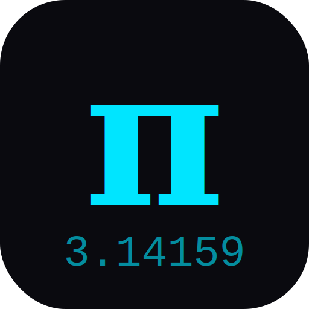
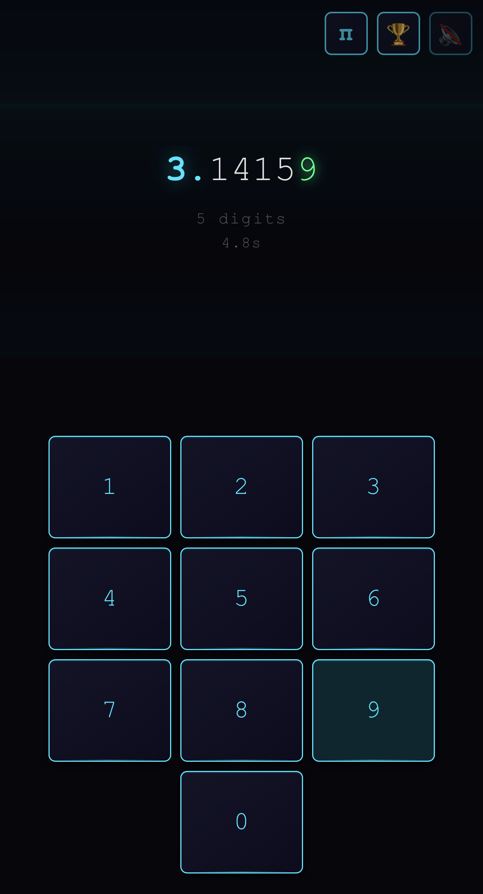

<div align="center">



# Pi Game

### How many digits of Pi live in your brain?



<a href="https://paulgibeault.github.io/pi-game/">
  
</a>

---

*One wrong digit and it's over.*

</div>

Pi Game is a fast-paced memorization gauntlet. Tap digits of Pi on a number pad as fast as you can — every correct digit extends your streak, every mistake ends it. The display grows with you, the sounds rise in pitch, particles explode across the screen, and the pressure never stops.

**Simple to learn. Impossible to master.**

## The Challenge

1. **Press Start.** The clock begins.
2. **Type digits of Pi** after the decimal — 1, 4, 1, 5, 9...
3. **One wrong press and it's game over.** Your score and time hit the leaderboard.
4. **Autopsy** reveals exactly where you choked, so you know what to study.
5. **Study Mode** — memorize Pi in chunks of 50 with cover/reveal flashcards.
6. **Practice Mode** — a scrolling teleprompter lets you type along without the pressure.

## What Makes It Special

- **4 Visual Themes** — Neural Network (cyberpunk), Precision Blueprint (drafting), Abstract Gallery (minimalist), Orbital Gravity (deep space)
- **Synthesized audio** that rises in pitch as your streak grows, with combo harmonics for fast fingers
- **Particle effects & screen shake** on every keypress
- **Leaderboard** tracking your top 5 runs
- **Install it** — add to your home screen for a native app feel (PWA)
- **Works offline** — no internet needed after first load
- **Resume mid-game** — close the tab, come back later, pick up right where you left off

## Development

Pi Game runs on the **Arcade SDK** — the shared launcher framework hosted at [paulgibeault.github.io](https://paulgibeault.github.io). Game state, settings (audio volume, reduced motion), and the leaderboard all flow through `Arcade.state`, `Arcade.settings`, and `Arcade.scores('classic')` instead of touching `localStorage` directly. A one-time migration moves legacy saves into the SDK on first load. In production both the launcher and the game live at the same origin so the SDK's `postMessage` / `allow-same-origin` iframe contract works out of the box.

The repo ships two dev scripts for the two ways you'll want to run it:

### `./go.sh` — game in isolation

Serves just `pi-game` on `http://localhost:8790`. Mirrors `arcade-sdk.js` from a sibling clone of `paulgibeault/paulgibeault.github.io` so `/arcade-sdk.js` resolves the same way it does in production. Use this when you're iterating on the game itself.

### `./ago` — game inside the launcher

Stages the launcher and `pi-game/` into a single same-origin tree under `.arcade-stage/` and serves it on `http://127.0.0.1:4792`. URLs are rewritten to the local origin and service workers are defanged on both sides so edits aren't masked by SW caching. Use this when you're testing how the game behaves *inside* the Arcade launcher (suspend/resume, score sync, settings propagation).

```sh
./ago          # build, stage, serve, open browser
./ago stop     # kill the running server
```

Set `ARCADE_LAUNCHER_DIR` if your launcher checkout isn't the default sibling path, or `ARCADE_PORT` to change the port.

<div align="center">

---

*3.14159265358979323846264338327950288...*

**How far can you go?**

<a href="https://paulgibeault.github.io/pi-game/">
  
</a>

---

### More from the PaulStation Catalog

<table>
  <tr>
    <td align="center" width="25%">
      <a href="https://paulgibeault.github.io/hecknsic/">
        <br />
        <b>Hecknsic</b><br />
        <sub>Hexagonal Puzzle</sub>
      </a>
    </td>
    <td align="center" width="25%">
      <a href="https://paulgibeault.github.io/cozy-solitaire/">
        <br />
        <b>Cozy Solitaire</b><br />
        <sub>Klondike · FreeCell · Spider</sub>
      </a>
    </td>
    <td align="center" width="25%">
      <a href="https://paulgibeault.github.io/si-syn/">
        <br />
        <b>Silicon Syndicate</b><br />
        <sub>Logic Puzzle</sub>
      </a>
    </td>
    <td align="center" width="25%">
      <a href="https://paulgibeault.github.io/sew-what/">
        <br />
        <b>Sew What</b><br />
        <sub>Garment Design Puzzle</sub>
      </a>
    </td>
  </tr>
</table>

</div>